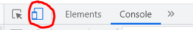
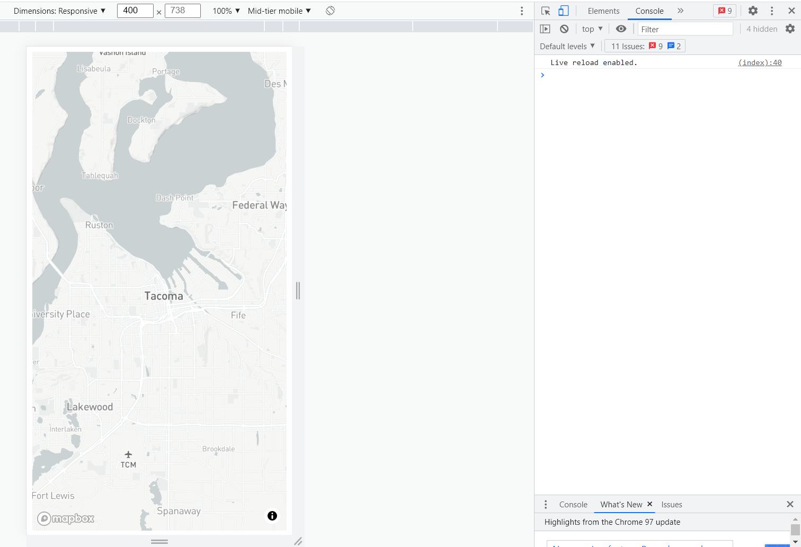

# Lab 2: Turf.js with Mapbox 

## TGIS 504, Winter 2023, Dr. Emma Slager

### Introduction

In this lab, you will practice making web maps that design for the unique affordances of mobile devices, this time incorporating the Turf JS library to do some basic spatial analysis in real time. With Turf's analysis capabilities, we can make maps to do things like find the nearest gas station to a user out running errands, or draw a buffer around a field analyst's observation of an environmental hazard. Real-time spatial analysis with interactive maps is often carried out most usefully on mobile devices--both because mobile devices can provide more accurate geolocation, which might be an important input to such analyses, and because mobile devices are what many users are mostly likely to have on hand when the need for such an analysis arises. This lab will first walk you through a tutorial that introduces one method of Turf JS--nearestPoint. Then on your own, you will use another Turf method to add some additional functionality to your map. 

Imagine you are part of a team that manages health and safety for the Tacoma Public Libraries. One important part of your preparedness mandate is to know which hospital is closes to each library in case there is an emergency at one of the library facilities. Steps 1-3 of this lab will walk you through making a map of libraries and hospitals; then, when a user clicks on a library, the map will show which hospital is nearest.

The first part of this lab is based on the tutorial [Analyze data with Turf.js and Mapbox GL JS](https://docs.mapbox.com/help/tutorials/analysis-with-turf/), with additions and modifications by myself.

### Set up your workspace

Begin by downloading the template files for the lab, including an index.html, a scripts.js file, a styles.css file, and two JavaScript files named libraries.js and hospitals.js (these are our data for the lab). Save the files to your workspace, and open the files in VS Code or the text editor of your choice. As always, I recommend creating a GitHub repository for your files, saving your work frequently, and testing it regularly. To save you some time, I have already added links to the necessary Mapbox libraries in the head of the index, included some basic CSS styling, and have created a `<div>` element in the body of the index to hold the map. The scripts.js file is currently blank. 

### Step 1: Initialize the map and add data

#### 1.1 Initialize the map and prepare your testing environment

To initialize a Mapbox GL JS map, add the following script to your JavaScript file. Be sure to replace `{accessToken}` with your own personal Mapbox access token:

```javascript
mapboxgl.accessToken = '{accessToken}'
const map = new mapboxgl.Map({
  container: 'map', // container id
  style: 'mapbox://styles/mapbox/light-v10', // stylesheet location; feel free to change this if you prefer another style, but choose something simple that includes the road network. 
  center: [-122.4443, 47.2529], // starting position
  zoom: 10 // starting zoom
});
```

Now you should have a map centered on Tacoma, WA. Open your index in the Google Chrome browser and open Google Developer Tools. (Note: the following instructions are specific to Google Chrome, but if you prefer to test with Mozilla Firefox or another browser, you can search the Internet for how to achieve the same thing with your browser of choice. [Here](https://developer.mozilla.org/en-US/docs/Tools/Responsive_Design_Mode), for instance, are the Firefox instructions.) In the Developer Tools window, to the left of the toggle that lets you switch between 'Elements' and 'Console,' click the button that looks like an icon of a mobile phone and a tablet: 



This should change your view so that the map appears as it would on a mobile device. Using the menu at the top, you can change the simulated width and height of the device, throttle the responsiveness of loading times to mimic a slower mobile connection, and more. We'll use this mobile simulator to test our work throughout this lab. 



Next, let's add data for the libraries and hospitals. 

#### 1.2 Add your data

Included in the starter files are two data files, hospitals.js and libraries.js. Each file contains a geojson object that is defined as a variable. We'll access the variables (and thus the geojson objects) by variable name later in the code in order to use Turf.js. Note that it is possible to use Turf with a geojson stored as an external file (i.e. saved as a geojson file rather than as a js file), but doing so requires JQuery, so to keep things simple, we store the geojson data for this lab in standalone js files. 

Examine hospitals.js file and you will see the following:

```javascript
var hospitalPoints = {
  "type":"FeatureCollection",
  "features":[
    {"type":"Feature","geometry":{"type":"Point","coordinates":[-122.48083069805091,47.24158294247902]},"properties":{"NAME":"Allenmore Hospital","ADDRESS":"1901 S UNION AVE","CITY":"Tacoma","ZIP":98405}},
    {"type":"Feature","geometry":{"type":"Point","coordinates":[-122.29012358186617,47.17861596384059]},"properties":{"NAME":"Good Samaritan Hospital","ADDRESS":"401 15TH AVE SE","CITY":"Puyallup","ZIP":98372}},
    {"type":"Feature","geometry":{"type":"Point","coordinates":[-122.55190153531765,47.109023185217126]},"properties":{"NAME":"Madigan Hospital","ADDRESS":"9040 JACKSON AVE\r\n","CITY":"Tacoma","ZIP":98431}},
    {"type":"Feature","geometry":{"type":"Point","coordinates":[-122.50212346172164,47.15457916145514]},"properties":{"NAME":"St Clare Hospital","ADDRESS":"11315 BRIDGEPORT WAY SW","CITY":"Lakewood","ZIP":98499}},
    {"type":"Feature","geometry":{"type":"Point","coordinates":[-122.44793640184797,47.24530738056208]},"properties":{"NAME":"St Joseph Medical Center","ADDRESS":"1717 S J ST","CITY":"Tacoma","ZIP":98405}},
    {"type":"Feature","geometry":{"type":"Point","coordinates":[-122.45305284917963,47.25946004827884]},"properties":{"NAME":"Tacoma General Hospital","ADDRESS":"315 MARTIN LUTHER KING JR WAY","CITY":"Tacoma","ZIP":98405}},
    {"type":"Feature","geometry":{"type":"Point","coordinates":[-122.61346848763097,47.3644245711541]},"properties":{"NAME":"St Anthony Hospital","ADDRESS":"11567 CANTERWOOD BLVD NW","CITY":"Gig Harbor","ZIP":98332}},
    {"type":"Feature","geometry":{"type":"Point","coordinates":[-122.57559702458708,47.13526338360076]},"properties":{"NAME":"VA Puget Sound Health - American Lake","ADDRESS":"9600 VETERANS DR SW","CITY":"Tacoma","ZIP":98493}}
  ]
};
```

As explained above, this is a JavaScript file containing a var named 'hospitalPoints' that holds a geojson FeatureCollection of [hospitals in Pierce County](https://gisdata-piercecowa.opendata.arcgis.com/datasets/public-health-care-facilities). Similarly, the libraries.js file contains a var named 'libraryPoints' holding a geojson Feature Collection of [Tacoma Public Libraries](https://gisdata-piercecowa.opendata.arcgis.com/datasets/libraries). (Those links will take you to the original data sources; I prepared the data in ArcMap by exporting only those features that met certain criteria, by deleting unnecessary columns from the attribute data, by projecting into WGS 1984, and then by converting to geojson).

We need to link to these files in the index in order for the data to be useable by the map. Copy the following lines of code into the body of your index.html file, below the link to the scripts.js file: 

```html
	<script src="data/libraries.js"></script>
	<script src="data/hospitals.js"></script>
```

Next, we'll use a `map.on('load', function(){});` to add the data to the map as layers. At the bottom of your JavaScript file, add the following code:

```javascript
map.on('load', function() {
  map.addLayer({
    id: 'hospitals',
    type: 'symbol',
    source: {
      type: 'geojson',
      data: hospitalPoints
    },
    layout: {
      'icon-image': 'hospital-15',
      'icon-allow-overlap': true
    },
    paint: { }
  });
  map.addLayer({
    id: 'libraries',
    type: 'symbol',
    source: {
      type: 'geojson',
      data: libraryPoints
    },
    layout: {
      'icon-image': 'library-15',
      'icon-allow-overlap': true
    },
    paint: { }
  });
    
});
```

Refresh your page to test your code. You should see a medical cross icon for the hospitals and a book icon for the libraries. Examine the code to figure out how this works. Try answering these comprehension self-assessment questions (answers at the end of the instructions): 

* When do the layers get added to the map? Asked another way, what JavaScript *event* needs to take place before the layers get added? 
* What *method* do we use to create the layer? 
* If we wanted to do something with the libraries layer later, such as add clickable pop-ups to the features, what id would we use to reference the layer? 
* Both of these layers are of the type `symbol`, which essentially means the layer is composed of point features represented by icons. By recalling from fall quarter's Intro to Mapbox lab and/or by consulting the [Mapbox layer documentation](https://docs.mapbox.com/mapbox-gl-js/style-spec/layers/), what is the Mapbox layer type keyword for a polygon layer? 
* You've seen the `paint` option before in last quarter's Intro to Mapbox lab, but `layout` is new. According to [the Mapbox documentation](https://docs.mapbox.com/mapbox-gl-js/style-spec/layers/#layer-sub-properties) what is the difference between layout properties and paint properties? 

In this code, we use the `layout` option to define the icon that will display for the features in each layer. Both of these icons are conveniently built into the default Mapbox styles, so we can reference them by their names, `hospital-15` and `library-15`. If we wanted to use a custom icon instead of one that is built in to Mapbox, we would have to add the icon image with an additional method --`map.addImage('url_goes_here')`-- before we could reference it with the `icon-image` layout property. Note that we use the `icon-allow-overlap` option to specify that it is OK if the icons overlap one another. This ensures the icons will display at any zoom level, though they may overlap one another when the map is significantly zoomed out.

### Step 2: Add clickable popups

Hover-over effects do not work particularly well with touch-screen mobile devices, so whenever we're designing for mobile, it is best to use 'click' event listeners (which are also effective with taps) rather than 'mousemove' listeners. Let's start with a popup for the Hospital layer. At the bottom of your JavaScript file, add the following code:

```javascript
var popup = new mapboxgl.Popup();
map.on('click', 'hospitals', function(e) {
  var feature = e.features[0];
  popup.setLngLat(feature.geometry.coordinates)
    .setHTML(feature.properties.NAME)
    .addTo(map);
});
```

Now when we click on any of the hospital icons, we should get a popup showing the hospital's name. **On your own, add some code to the .setHTML line of the code to also display the hospital's address** (and add a space or other formatting between the name and address so that they don't run together.) Hint: view the GeoJson file stored in the 'hospitalPoints' variable to find the name of the property that holds the address values.

For the interactivity on the library layer, we want to do a little more than just add the library's name to a popup. To achieve the goal of helping library staff identify the nearest hospital to teach library facility, we want the map to do three things when we click a library:

1. Identify the nearest hospital
2. Add a blue circle around the nearest hospital to help the user visually identify the hospital
3. Add both the library's name and the nearest hospital's name and address to a pop-up window.

We'll achieve these tasks one by one in the next step.

### Step 3: Using Turf to find the nearest point

[Turf](https://turfjs.org/) is a JavaScript library for adding spatial and statistical analysis to web maps. It contains many commonly used GIS tools--like buffer, union, and merge--as well as statistical analysis functions like sum, median, and average. One of Turf's functions is nearestPoint, which we'll use to find the hospital that is nearest each library.

First, let's add a link to the Turf library in the head of our index file.

```html
<script src='https://unpkg.com/@turf/turf@6/turf.min.js'></script>
```

Next, let's take a look at the Turf documentation to understand how nearestPoint works, what inputs we need to give the function, and what results we can get out of it. Visit https://turfjs.org/docs/#nearestPoint and read the documentation on this method. As the docs say, nearestPoint "takes a reference point and a FeatureCollection of Features with Point geometries and returns the point from the FeatureCollection closest to the reference." For our purposes, the reference point will be the library location that the user has clicked, and the target FeatureCollection will be the array of hospital locations stored in the hospitalPoints variable. One thing to note about this calculation: it uses birds-eye distance rather than network distance, and it's geodesic, meaning it follows the curve of the earth.

Let's start by creating an event listener that will trigger a function when a library point is clicked. At the end of your JavaScript file, add the following code:

```javascript
map.on('click', 'libraries', function(f) {
    
});
```

Note that we are referencing the libraries layer by the id we gave it (`'libraries'`) when we added the layer to the map. Now let's complete our tasks. First, let's find the nearest library. Inside the { } in the code you just added, add the following:

```javascript
  // Using Turf, find the nearest hospital to library clicked
  var refLibrary = f.features[0];
  var nearestHospital = turf.nearest(refLibrary, hospitalPoints);
```

Here we use the `turf.nearest` method, giving it the library that was just clicked as the first parameter and the array of hospital locations as the second parameter.

Self-check question: where does the keyword 'hospitalPoints' come from? 

Next, let's do something with the results of the nearest calculation. We want to add a circle around the nearest hospital, but that circle needs to exist in a map layer, and that layer needs a source. To achieve this, we'll therefore add a blank source to the map on map load, then we'll update that source with the identity of the nearest hospital, and finally, we'll use the newly updated source to add a layer with a circle.

**Inside the map.on('load', function() { } section of your code**, after the two `map.addLayer` sections of code but before the onload function closes, add the following:

```javascript
  map.addSource('nearest-hospital', {
    type: 'geojson',
    data: {
      type: 'FeatureCollection',
      features: [
      ]
    }
  });
```

Note that the square brackets in the `features: [ ]` section of code represent a JavaScript array that would ordinarily contain coordinate pairs or other feature geometry that we might typically see in a GeoJSON. However, we've left this blank and will add feature geometry to the array based on where the user clicks on the map. Next, inside the function that runs when a library is clicked, add the following:

```javascript
	// Update the 'nearest-hospital' data source to include the nearest library
	map.getSource('nearest-hospital').setData({
      	    type: 'FeatureCollection',
      	    features: [
               nearestHospital
      	    ]
    	});

	// Create a new circle layer from the 'nearest-hospital' data source
	map.addLayer({
      	    id: 'nearestHospitalLayer',
	    type: 'circle',
	    source: 'nearest-hospital',
	    paint: {
		'circle-radius': 12,
		'circle-color': '#486DE0'
	    }
	}, 'hospitals');

```

Now, when you click a library, you should see a blue circle appear around the nearest hospital to that library. Test this and troubleshoot your code as necessary if it does not work as expected. Finally, let's add a popup that gives the library name and information about the nearest hospital. This information is stored inside the GeoJSONs that are in our data files. Still inside the function that runs when a library is clicked, add the following:

```javascript
//Add popup that gives name of the library and the name and address of the nearest hospital
popup.setLngLat(refLibrary.geometry.coordinates)
    .setHTML('<b>' + refLibrary.properties.NAME + '</b><br>The nearest hospital is ' + nearestHospital.properties.NAME + ', located at ' + nearestHospital.properties.ADDRESS)
    .addTo(map);

```

Save and test. With ~80 lines of code or so, you've (hopefully) succeeded at making a tool that will allow library staff to find their nearest hospital in Tacoma. As you test this in the browser, you may notice that on the second and any subsequent library clicks you make, you get an error message in the console that reads "Error: Layer with id "nearestHospitlaLayer" already exists on this map." This is because the function we execute with the `map.getSource('nearestHospital').setData` bit of code is trying to add data to a feature collection that already contains data, whereas on the first click, that feature collection is blank. For this application, we can safely ignore this message. 

### Step 4: Use Turf to add a distance calculation to your popup

On your own, use the turf.distance method (documentation [here](https://turfjs.org/docs/#distance)) to calculate the distance from the library that was clicked to its nearest hospital. Add this distance calculation to the popup that appears when a library is clicked, also adding some formatting and framing text to help the user understand.

Be sure to use **miles** for your units, and use the built-in JavaScript method [toFixed()](https://www.w3schools.com/jsref/jsref_tofixed.asp) to limit the display of the distance calculation to just two decimal points. Your finished product should yield a popup that looks something like this:

[](https://github.com/UWTMGIS/TGIS504_Wi21/blob/master/lab-1b/image1.png)

You should be able to achieve this with the addition of just 4 lines of code and modification to one existing line, though you *can* do it with as little as one additional line of code. Tips:

- Think about where the additional line(s) of code need to be placed within your existing code.
- Since the from and to points require coordinates, think about how to get those coordinates using variables that are already named in your code.

### Step 5: Final preparation
Finally, complete these steps before submitting your work: 
* Add a title and brief explanatory text to the map to explain what it does to a potential user of the tool you've built. Ensure that  layout works well on both the mobile device simulator and on the desktop browser view. 
* Either with explanatory text or using the [attribution control](https://docs.mapbox.com/mapbox-gl-js/api/markers/#attributioncontrol), cite the data sources for the library and hospitals based on the links in Step 1 of these instructions. 
* Tidy up your code (i.e. delete extraneous line spaces and ensure good tabbing)
* Optionally, change the basemap or other styling to your liking 

### Submission

Submit a link to your final work on Canvas. Along with the URL to the live version of your final map, submit a response to the following questions. Your answer should be a paragraph in length (~150-200 words):

Browse the Turf JS documentation and the different methods it makes available. Choose one method that is familiar to you from prior GIS work you have done with desktop GIS software, such as ArcMap or QGIS. If you are having trouble deciding on a method to examine, I suggest Buffer.

1. What analysis method or task/tool did you choose?
2. How does Turf's method of accomplishing this geospatial analysis task compare to the method you learned using desktop GIS? Do any of the inputs, parameters, or outputs of the operation differ from what you are familiar with? If so, how?

### Self-assessment questions and answers

* When do the layers get added to the map? Asked another way, what JavaScript event needs to happen before the layers get added? 
  * Answer: The map needs to finish loading before the layers get added. We know this because of the first line of the codeblock: `map.on('load', ...`
* What *method* do we use to create the layers? 
  * Answer: `.addLayer`. This gets appended to the map object, once for the libraries layer and once for the hospitals layer.
* If we wanted to do something with the libraries layer later, such as add clickable pop-ups to the features, what id would we use to reference the layer? 
  * Answer: 'libraries'. This should be an easy one. :) Remember that we can change that id to any string value we want, and if we reference it later, we just need to use that same id. 
* Both of these layers are of the type `symbol`, which essentially means the layer is composed of point features represented by an icon. By recalling from fall quarter's Intro to Mapbox lab and/or by consulting the [Mapbox layer documentation](https://docs.mapbox.com/mapbox-gl-js/style-spec/layers/), what is the Mapbox layer type keyword for a polygon layer? 
  * Answer: fill 
* You've seen the `paint` option before in fall quarter's Intro to Mapbox lab but `layout` is new. According to [the Mapbox GL JS documentation](https://docs.mapbox.com/mapbox-gl-js/style-spec/layers/#layer-sub-properties) what is the difference between layout properties and paint properties? 
  * Answer: both properties affect how the layer is displayed, but layout properties are applied asynchronously and paint properties are applied synchronously. The difference is technical, not aesthetic, where properties that are technically slower to display are made asynchronously so as to ensure a smooth rendering process for the user. The Mapbox Style Specification documentation lists whether each one of the style properties we can apply to a map is a layout property or a paint property. 
* Where does the keyword 'hospitalPoints' come from? 
  * Answer: This is the name of the variable we declared in the hospitals.js file to hold the hospitals GeoJSON.  
