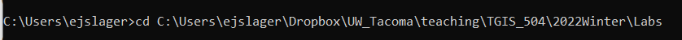
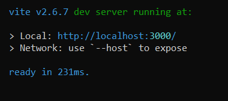
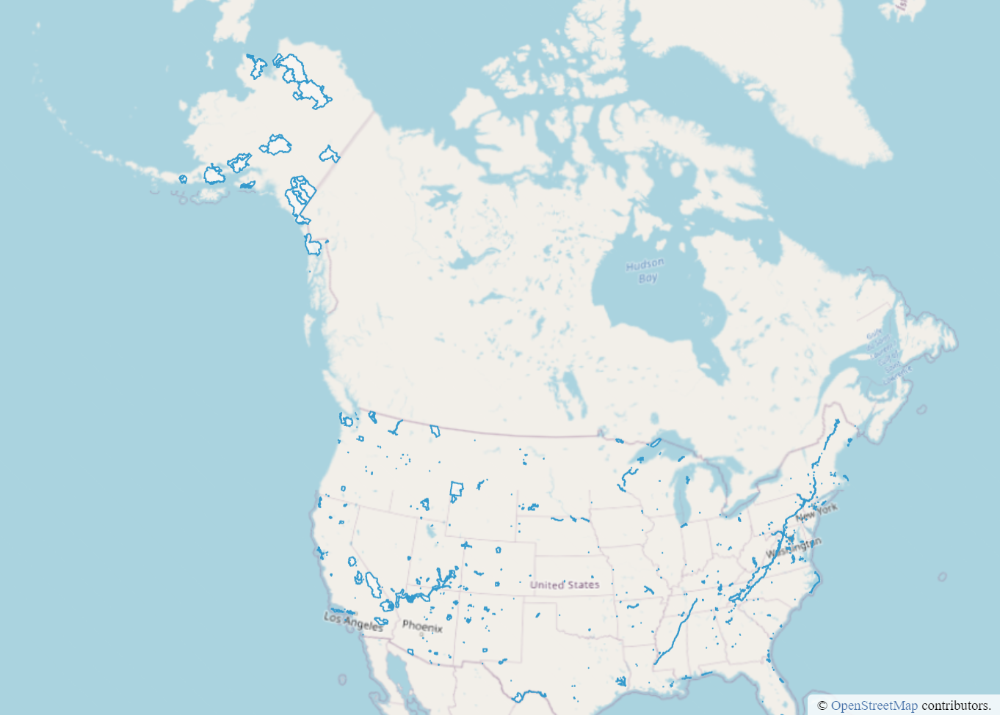

# Lab 3: Web mapping with projections and OpenLayers

## TGIS 504, Winter 2023, Dr. Emma Slager

## *This lab will not be formally assigned, but I encourage you to work through it and I will review the key learning goals in class next week.*  

### Introduction

In this lab, we'll be working with a new web mapping framework, OpenLayers. Much like Mapbox and Leaflet, OpenLayers has an API that we can access and utilize using a CDN, but the OpenLayers documentation expects that most users will instead create their applications using JavaScript modules. To this end, OpenLayers is available on the node package management platform Node.js. We use Node.js using the command prompt and a specific interface called NPM (node package manager). NPM is a levelling up of your web development skills, and it can be a bit intimidating at first, but I promise you'll get the hang of it in no time. In fact, it's incredibly powerful, and I suspect by the end of this lab you might even be wondering why I haven't introduced it sooner. 

We'll use NPM to set up, test, and eventually deploy our web map websites in this lab. The map you'll be making in this lab will not use WGS 84, Web Mercator, or any other rectangular projection. 

### Step 1: Setting up your work environment

#### Installing Node.js and checking to see if you have Git installed

OK, first things first. To use NPM, we first need two other softwares: Node.js and Git. If you are working on the lab computers, these are already installed and you can move on to the next heading ("Using Command Line"). If you are working on a personal computer, follow the instructions below to install Node.js. 

To install Node.js, go to [the download website](https://nodejs.org/en/) and install the version appropriate for your operating system. Though version 19 is available, I recommend v18, which is currently recommended for most users while bugs in v19 are still identified and fixed.  

#### Using Command Line

Next, open up the command line interface for your computer. For Windows, search for the Command Prompt application, for Mac, search for Terminal. If you're using Linux, I assume you know how to find your command line interface already. :)

Command line is a way of interacting with your computer using text commands instead of a graphical user interface, or GUI. For instance, if I told you to navigate to the folder where you're storing your files for TGIS 504, you might open up your file manager and use your mouse click folder icons until you get to the folder you want to get to. Or, you could get there using command line. For instance, type `dir` into the command line interface and press Enter. You should see a list of all the folders on your computer. You could type `cd` (for change directory) then a space, then the name of one of those folders to open that folder, just as you would by clicking in the file manager GUI. 

Let's use the command line to see if you have Git installed on your computer already. Type

```git version```

into the command line and hit Enter. The output will either tell you which version of Git is installed, or it will alert you that `git` is an unknown command. If you have Git installed already, skip ahead to Step 2. If you don't have Git installed, read on. 

#### Installing Git

It's likely that you already have Git installed, because it is frequently installed with GitHub Desktop. Also, it tends to be installed by default on Mac and Linux machines. But if you don't have Git installed, follow the instructions [on this website](https://github.com/git-guides/install-git) to install it from an Installer. You should be able to accept all the default settings in the installer. 

Once you've installed Git, quit and restart your command line interface. When you have it open again, type `git version` and hit Enter, and this time you should see the version of Git that you have installed, confirming that it is indeed installed. 

### Step 2: Use npm to set up your OpenLayers application

In the command line interface, navigate to the folder on your hard drive where you store your lab files for this class. I recommend you do this in the following way, but if you know enough about command line already to do this yourself, feel free to do so: 

* Open your file manager and find the full path name for the folder where you store your files. I assume you know how to find a pathname from your past GIS work, so Google this if you need a refresher. For instance, when I test the labs, I store my files on my C:/ drive, in a series of folders with the following pathname: C:\Users\ejslager\Dropbox\UW_Tacoma\teaching\TGIS_504\2022Winter\Labs. 

* Once you've located the pathname for your lab folder, copy the pathname

* Type `cd` in the command line, then a space, then paste the pathname. For instance, mine looks like: 

  

* Now enter the following commands: 

  ```
  mkdir lab3 && cd lab3
  ```

* This makes a directory (folder) with the `mkdir` command and names it lab3. Then with the `cd` (change directory) command, we open that new folder. If you get an error message, carefully check your command to find any typos and try again. 

* Next, enter the following: 

  ```
  npm create ol-app ol-lab
  ```

* This will create a folder called `ol-lab` (you can choose another name if you wish) and install the `ol` package, the main library for OpenLayers. It will also set up a development environment with additional dependencies (think of these as sub-libraries), and give you an index.html, main.js, and style.css files, which will be the starting point for the application. 

* Next, enter the following: 

  ```
  cd ol-lab
  npm install proj4
  ```

* This opens the ol-lab folder, then installs an additional javascript library, [Proj4](https://github.com/proj4js/proj4js), which we'll use for projections. 

In your file manager (Windows Explorer, or MacOS Finder), navigate to your new lab3 folder and check that there is indeed now a bunch of stuff stored in that folder. Yahoo! Well done. 

Open the Index.html file in VS Code or your preferred text editor. It should be a relatively familiar boiler plate index file, with a `<div>` with the id 'map' and a link to some JavaScript in the 'main.js' file. 

Back in command line, enter

```
npm start
```

This will take a brief moment, and then you should get a message that looks like this (note, my screen shots are all from a Windows OS): 



This is telling us that we've set up and started a local server for testing our files, just like we would through atom-live-server in Atom or the live server in VS Code. Open up your preferred web browser, and type the Local url listed in your command line into browser bar. That url is likely http://localhost:3000/ or http://localhost:5173/, but it may use a different port number if your settings are somehow different from mine. 

When the page loads, you should see a map! Once you get past the unfamiliarity of command line, it's a pretty easy way to set up your mapping environment, no? If things haven't gone as expected and you don't see the map, reach out to me and we'll get you sorted out right away. 

### Step 3: Using the OpenLayers API to add data to the map and style it

For now, we'll be back to familiar territory for a bit, using VS Code to work with the HTML, JS, and CSS. 

In VS Code, let's look at our files and figure out what's going on. Open 'main.js': 

```javascript
import './style.css';
import {Map, View} from 'ol';
import TileLayer from 'ol/layer/Tile';
import OSM from 'ol/source/OSM';

const map = new Map({
  target: 'map',
  layers: [
    new TileLayer({
      source: new OSM()
    })
  ],
  view: new View({
    center: [0, 0],
    zoom: 2
  })
});
```

The four lines at the top that begin with `import` may be unfamiliar to you, though I've seen this in some of y'all's code already. The `import` statement is a way of linking to other files, similar to what we do when, for instance, we link to the leaflet CSS and JS libraries in the head of our index when we're creating a leaflet map. If you poke around inside the `node_modules` folder inside the lab3/ol-lab folder, you should be able to find the folders and files being referenced in those `import` statements. 

What you should understand about this at this time is that we're linking to different modules, or sections of the OpenLayers library, so that we're loading into our website only the parts of the source code that we need to make the map work. This will improve the performance of our web page and map considerably. 

Thus, when you implement different features of OpenLayers when building with npm and modules, you not only need to reference the necessary methods (e.g. `new Map ()` in line 6 of the main.js file), but you also need to import the modules where those methods exist in the library. 

Let's start by adding a GeoJSON layer to the map. Add the following three modules to the list of imports at the top of your main.js file: 

``` javascript
import GeoJSON from 'ol/format/GeoJSON';
import VectorLayer from 'ol/layer/Vector';
import VectorSource from 'ol/source/Vector';
```

Next, we're going to need GeoJSON **data**. In the GitHub repository for this class, you can find a data file called `nps-project.json`. Download this if you haven't already, and move it into your ol-lab folder. This is a polygon feature collection of all of the US National Parks, National Monuments, National Historic Sites, and other properties managed by the National Parks Service. I downloaded it from [this source](https://public-nps.opendata.arcgis.com/datasets/nps-boundary-1/explore?location=12.665142%2C-12.497900%2C1.77), then reprojected it, simplified its attributes and geometry, and converted to GeoJSON. 

Next, change the part of your JavaScript code that specifies the `layers` to add to the map to the following: 

```javascript
layers: [
    new TileLayer({
      source: new OSM()
    }),
    new VectorLayer({
      source: new VectorSource({
        format: new GeoJSON(),
        url: 'nps-project.json',
      }),
    }),
  ],
```

After the existing TileLayer (the basemap tiles), we've added a VectorLayer. We've specified the source of that VectorLayer as the nps-project.json file, and formatted it as a GeoJson. Preview your changes on the local server, and you should now see the data on your map. 

### Step 4: Projection

So far, OpenLayers probably feels pretty familiar to you. It's very much like Mapbox and Leaflet: a JavaScript library with a series of methods and parameters that let you display a map, add layers to the map, and (eventually) add style and interactivity to the layers. So let's move into the unfamiliar territory of working with projections in a web map. 

For a whole host of reasons covered in lecture and readings, the vast majority of interactive web maps on the Internet use the Web Mercator projection, with data overlays usually using the unprojected WGS84 datum. Web Mercator is conveniently cylindrical, making it easy to quickly render square tiles that cover the whole surface of the earth to make up the map. As you know however, Mercator projections have many, many limitations, related to cartographic design, analytical accuracy, and cognitive implications. 

So for this map, we're going to map National Parks not based on Web Mercator, but based instead on the [US National Atlas Equal Area projection](https://spatialreference.org/ref/epsg/us-national-atlas-equal-area/), a conic equal area projection optimized for the US to minimize distortions of shape and direction. 

First, let's import the necessary modules. To the list of imports at the top of your main.js file, add the following: 

```javascript
import Projection from 'ol/proj/Projection';
import proj4 from 'proj4';
import {transformExtent} from 'ol/proj';
import {fromLonLat} from 'ol/proj';
import {register} from 'ol/proj/proj4';
```

The Projection module allows us to define the projection for our map, instead of using the default Web Mercator. The proj4 module gives us access to the Proj4.js library (not part of OpenLayers, but a library that works well with OpenLayers, if we also include the proj4 register module from OL). The other two modules give us some additional functionality needed to work with projections and coordinate pairs (which are unprojected). 

By default, OpenLayers only supports two projections: Web Mercator and WGS84, but with the Proj4 library, we can get access to thousands more in the EPSG registry. The first addition we'll make after the imports, then, is to specify what projection we want to work with. 

In your main.js, below the import list and before the `const map` declaration, add the following: 

```javascript
proj4.defs("EPSG:2163","+proj=laea +lat_0=45 +lon_0=-100 +x_0=0 +y_0=0 +a=6370997 +b=6370997 +units=m +no_defs");
register(proj4);
```

Here we're using a method from the Proj4.js library to define the projection we want to use. The first parameter in the parentheses, `"EPSG:2163"`, is the name of the projection. We could give this any string value we want, such as "US Equal Area", but I've used its EPSG code for simplicity. We can reference the projection by this name later. 

The second parameter--`"+proj=laea +lat_0=45 +lon_0=-100 +x_0=0 +y_0=0 +a=6370997 +b=6370997 +units=m +no_defs"`--provides some mathematical information explaining how to transform unprojected latitude and longitude coordinate pairs into the projection. Additionally, it specifies that the projection uses meters for its units, and does not specify a datum. 

I accessed this information about the projection we're using from [its entry in the EPSG registry](https://epsg.io/2163). You can find this information about any other projection you might want to use on [EPSG.io](https://epsg.io/). 

Finally, we use the `register(proj4)` method (a method in the OpenLayers library) to ensure that our map can make sense of the projection information. 

If you preview your map at this time, you shouldn't see any changes, but you should still preview it and check the console to ensure that everything is still working and nothing has broken. If the map doesn't appear, check your code for typos, using the console messages as needed. 

To make the projection actually appear, we need to make a couple of changes to the `view` option when we initialize our map. In your main.js file, **replace** the `view` section of your code with the following: 

```javascript
view: new View({
    projection: 'EPSG:2163',
    center: fromLonLat([37,-95], 'EPSG:2163'),
    zoom: 3,
    extent: transformExtent([167.65, 15.56, -65.69, 74.71], 'EPSG:4326', 'EPSG:2163'),
  })
```

Here we are doing the following: 

1. defining our projection, using the name we gave the projection above; 

2. defining the center of the map as the center of the US, using a method that transforms unprojected coordinates into the EPSG: 2163 projection;

3. specifying the initial zoom level;

4. specifying that the extent of the map can't exceed the extent covered by the projection, again using a method to transform coordinates from their initial projection (EPSG: 4326, or WGS84) into the new projection. 

   *A note about the extent:* This too is information I got from the [EPSG.io entry for this projection](https://epsg.io/2163). If you wanted to use a different projection, you would need to provide that projection's extent information instead. 

Preview your map: Goodbye cylindrical Mercator projection, hello conic equal area! 



You'll notice that the sharpness of the image quality is lost a bit. This is an artefact of transforming tiles that  were created to be displayed with Web Mercator into a different projection. For now, we'll deal with it, but if you wanted to make a super sharp map, you could find or create basemap tiles that were designed for specific use with your specific projection. 

### Step 5: styling the map (and bonus making the polygons clickable)

OK, enough with the cookbook instructions and the copying and pasting! At this point, you should be able to read JavaScript documentation and figure out how to do things like style a GeoJSON and make it interactive. In this step, your task is to do just that. Use the OpenLayers documentation, your ability to read a GeoJSON file, and your wits to figure out how to style the map so that the National Parks (as opposed to the National Historic Sites, National Landmarks, etc.) are a different color polygon than the other features. 

I recommend using [this tutorial](https://openlayers.org/workshop/en/vector/style.html) to help you with the styling. It comes from a longer OpenLayers workshop but covers the concepts you will need to complete this step. Remember that you'll need to import modules AND write your methods. If you get a message in the JS console that some method you use is undefined, chances are good you forgot to import the necessary module(s). 

Use what you learned last quarter about conditional styling (if/else statements may come in handy) and remember as well that you will need to examine the nps-project.json file to figure out which property stores the information about whether a site is a national park or another NPS site. 

If you're feeling ambitious and want to challenge yourself for bonus points, search for documentation, tutorials, and/or forum posts that will help you figure out how make the features clickable so that the user can click a polygon to get a pop-up that tells them the name of the park and any other information from the GeoJSON you want to include. 

### Step 6: Deploying online and submitting your work

The final step is to put your finished product on the web so that you can submit a URL to your work. You *could* do this the same way we've been doing it all through the program so far: upload all your files to a GitHub repository, turn on Pages, and call it good. However, that would mean that you have to package up the entire OpenLayers library you downloaded, and it would waste all the effort we went to to include just the specific modules we needed. Instead, follow these steps to make a `dist` folder with just the parts of the library you need, and all the code and data you added yourself. 

Return to the command prompt. If you closed it between Part 1 and now, you'll have to navigate again (using the `cd` command) to your lab3/ol-lab folder. Once inside the ol-lab folder, enter

```
npm run build
```

This runs a module that will collect just the modules you imported, plus your web files, and package them in a `dist` (for distribution) folder that you can upload to GitHub. Find that `dist` folder inside the lab3 folder. ***Important ***: for some reason that I can't quite figure out, the geojson data file will not be copied into the dist folder. Copy and paste the nps-project.json file into the dist folder manually, then upload ONLY the files in the dist folder (plus your geojson data file) to a new GitHub repository, NOT the whole lab3 folder. np

This runs a module that will collect just the modules you imported, plus your web files, and package them in a `dist` (for distribution) folder that you can upload to GitHub. Find that `dist` folder inside the lab3 folder. ***Important not from last year (may no longer be relevant)***: for some reason that I can't quite figure out, the geojson data file will not be copied into the dist folder. Copy and paste the nps-project.json file into the dist folder manually, then upload ONLY the files in the dist folder (plus your geojson data file) to a new GitHub repository, NOT the whole ol-lab folder. 

Once you've uploaded, activate Pages and test out the live version to make sure everything works. Submit your URL on Canvas. There is no write-up for this lab, but if you want to provide any feedback on this lab or the instructions, please feel free to do so. It's a new one and would certainly benefit from the thoughtful suggestions this cohort always provides! 
