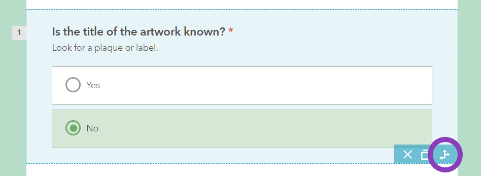
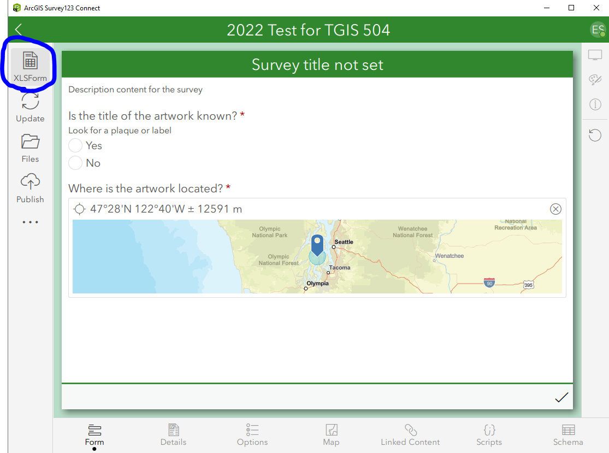

# Lab 4: Survey123 for ArcGIS

## TGIS 504, Winter 2023, Dr. Emma Slager
### Introduction

Mobile GIS has the potential to streamline and improve GIS data collection and data entry. Mobile data collection can save time and money, simplify data entry, and reduce room for errors and data redundancy, among other benefits. 

Data collection forms for geospatial data can use two kinds of interfaces: form-centric or map-centric. Esri makes data collection tools for both interfaces, and for agencies that have a well-established workflow in which ArcGIS is already integrated, Esri tools are popular choices for data collection carried out by field crews. Esri's form-centric data collection tool is Survey123 for ArcGIS. Lab 4 will have have you explore Survey123, requiring you to make and utilize a field survey, then access and export the data collected via that survey. 

Your task in this lab is to create a data collection form for gathering information about the location and characteristics of public art in your city. The form you create will collect location information as lat/long points, will utilize skip logic, and will include additional questions about the the art and/or the data collector that use a variety of question formats. 

### Step 1: Planning your data entry

A good data collection survey needs to be very well planned. You need to decide what data you need to collect and how to structure questions or data entry tasks that will best elicit the data you need. For this lab, you will be collecting data about the location and characteristics of public art. Our definition of "public art" is very broad. It might include things like sculptures and murals that have been officially commissioned by local government or private businesses, but it might also include things like architecture, graffiti, creative telephone pole signs, or vinyl stickers. 

Keeping this broad definition in mind, things that we want to know about the art include: 

* its location (lat/long point)
* title of the artwork, if known
* creator(s) of the artwork, if known
* medium of the art (e.g. mural, sculpture, architecture, installation, etc.)
* a brief description
* a photo
* whether the person collecting the data considers it good art
* some measure of its approximate size 
* Metadata about who collected the data and when
  * Data collector's name, username, or alias
  * Date and time of data collection
* Anything else you wish to include

As you plan your survey, think about how you will elicit each piece of information. For each bullet point above, think about how you want to phrase the question or data collection task. Will the user be able to enter information in a text box or will they have to select from multiple choice options? Will they be able to select more than one choice, or just one? What order will you ask the questions in? Can the user leave a field blank, or do they have to provide an answer? In a Word document/Google Doc or on scratch paper, begin to plan your form by thinking through each of the bullet points above. 

### Step 2: Create your form

1. Navigate to this link https://survey123.arcgis.com/, and click Sign In. You will need to sign in using your UWT organizational login. (These were assigned in fall quarter. Look for an email from Gregory Lund and/or from 'arcgis-notifications' if you need a reminder of your credentials.)

   * Both your form and the data collected with your form will be saved on ArcGIS Online server space in the UWT ArcGIS Online organizational account. To use Survey123, it is therefore necessary for your organization to have ArcGIS Online access, which has annual subscription fees and user fees associated with it. As you will learn in later labs, data storage and database configuration are some of the hardest parts of designing data collection tools. Esri makes this part extremely easy, but you (or your university or employer) pay for it in subscription fees to their services. 

2. Click ‘My Surveys’ and then press ‘Create a New Survey’ (or '+ New survey') and get started. There are two ways to create as Survey123 survey, using a web designer with a GUI or downloading a desktop application that lets you author your survey through XLSForms. We’ll use the web designer, which is simpler but will do for our purposes. It does not require you to download any software. Click ‘Get Started’ on the 'Blank survey' web designer option. 

3. Give your survey a name that captures your data collection goal. For the sake of grading, please be sure to include your name in your survey's name (for instance, 'Dr. Slager's Public Art Survey Form')

4. Give it tags and a descriptive summary and click 'OK'. 

5. Under the Design tab, you will see an option to add questions to your survey. The first questions you create will be for the title and creator(s) of the artwork. Many pieces of public art are accompanied by informational plates that provide this data; however, that is not always true, especially for public art that might not be officially sanctioned, such as graffiti or guerilla installations. To take this into account, we'll use skip logic for these first two questions. 

   1. Create a Single Choice question and give it the label "Is the title of the artwork known?"

   2. In the 'Hint' field, write "Look for a plaque or label"

   3. Make two choices available for the user to select, "Yes" and "No". (Click the minus (-) sign next to Choice 3 to remove it.)

   4. Under 'Validation' check the box to make this a required question

   5. Click 'Save'

   6. Click the 'Add' button to add a second question to your survey. Select 'Singleline Text' as the question type, and give it the label 'What is the title of the artwork?' Do not make it required. 

   7. Click the 'Add' button to add another Singleline Text question, this time giving it the label 'Give this artwork a name to be used in the database.' Again, do not make it required.

   8. In the form preview in the main part of the screen, click on question 1, then click the 'Set Rule' button that appears in the bottom right corner of the question: 

      

   9. In the 'Set rule' window, select If "Yes" and Show "What is the title of the artwork?". Then select If "No", Show "Give this artwork a name to be used in the database." Click OK. You should see an arrow icon appear in questions 2 and 3 showing the skip logic from question 1 that will make questions 2 and 3 appear depending on how the user answers question 1. 

   10. Repeat the steps above to create a Yes/No question with the label "Is the creator(s) of the artwork known" with appropriate skip logic questions depending on the user's answer. 

6. Complete the rest of your survey using the "Add" button and Question Type buttons to add the rest of the questions you planned in Step 1 to your survey. Remember to save your work often. 

   * Choices about question type, answer options, required questions, etc. are up to you. You will be assessed on whether the choices you make are appropriate to the kind of information being solicited. Incorporate what you've learned in lecture and readings as you make these decisions and create your form. 

   * Make sure you include a question for collecting geographic information (use the 'Map' question type, and the 'Point' option for 'Drawing tools'). Make it a required question. Set a default map extent based on the presumed areal extent of data collection for your survey and check the box to 'Ask for device's location when opening this question'. 

7. Experiment with Appearance options and modify this according to your choice. Under settings, enable and customize a Thank You Screen. 

### Step 3: Publish and Share your survey

**Modify the Data Schema and Publish** 

When you are satisfied with your survey questions, Click 'Publish'. Before finalizing your survey, click the 'Modify schema' button. Here you can view the field names of what will become a feature layer of the data collected with your survey. While these settings will not be visible to your users, they are important for the underlying structure of the data that will be collected. 

Label and Field type can only be edited back in the question design interface, but Name and Field Length can be edited here. Each record that is submitted will eventually be included in a data table of all of the data collected, where each question is represented by a column in the table. 

* "Name" is what that column will be called, and it cannot contain spaces or other special characters. 
* "Field Length" is the maximum number of characters the column can contain. Changing this can affect the amount of storage space required to store your data. 

There are default values here, but you can edit them, which you might do to simplify the attribute table of your future feature layer. For instance, the default name of the first question is "is_the_title_of_the_artwork_kno". 

1. Simplify this by changing the Name of your first question to "title_known". 

2. Review the rest of the schema and make any changes you want to make before finalizing your survey. 

3. Once you are satisfied with your schema, click 'Publish' again. Publishing can take a moment. 
4. *Note*: If you go back and make any changes to your survey later, you will have to not only 'Save' those changes but also 'Publish' them if you want them to be viewable by your users. 

**Share your survey with collaborators**

The next step is to share your survey with the users who you want to collect data in the field. For this lab, your 'collaborators' will be your classmates in the MSGT cohort. This is a group of users already created within the UW Tacoma Esri user group, so sharing is easy. I am also a member of the MSGT 2022-2023 cohort, so this will enable me to view and grade your surveys. 

1. Under the 'Collaborate' tab, set your sharing settings so that members of the MSGT 2022-2023 group can submit to your survey. 
2. Give users the ability to 'Add and update records'
3. Allow multiple submissions 
4. Set the survey to be 'Open: accepting responses'
5. Click 'Save'
6. Back at the top of the page, copy the link to the survey and paste this into your Lab Write-Up. 

### Step 4: Collect Data

For this part of the lab, you will access the survey you created on your mobile device and collect at least 3 data points. These should be real data! You may define art as broadly as you want, but I expect complete answers, including geolocation and photos, for three pieces of art to be included among your data. Great places to find public art include UWT's campus, public parks, downtown Tacoma, or downtown areas of other cities where you might live. Again, feel free to define art very broadly and get creative with your submissions! Collecting these points is not meant to be burdensome but to give you actual experience using Survey123. 

Survey123 surveys can be accessed and used on the web or on a mobile app that is available on iOS or Android. These instructions will walk you through accessing and using Survey123 via the app, but you may also access your survey using the URL you copied into your lab write-up via a mobile browser if you prefer. 

1. On your mobile device, download the Survey123 app from the Google Play Store or the Apple App Store. 
2. Once downloaded, open the app and sign in using your UWT log in credentials. 
3. To access surveys via the app, you must first download them. Downloading surveys allows you to access them in the field even if you do not have a data connection. This is important when collecting data in areas that are not well served by LTE or WiFi infrastructure. Download your survey with these steps: 
   1. Click your initials or profile image in the upper right corner of the app, then select Download Surveys
   2. This pulls up all surveys that are available to you to download via the UWT AGOL organization
   3. Find your survey by scrolling or searching for its name
   4. Click the download icon to the right of your survey title to download it to your device. 
   5. Click the back arrow (<) at the top of the screen 
   6. You should now see your survey available on your app home screen. Click the survey and then click the 'Collect' button. 
   7. Out in the world, collect at least 3 points of data, completing the survey for each point. After completing the survey, click the Check icon at the bottom of the screen. Here, you can choose whether to submit your survey response immediately ('Send now'), or save your response to submit later ('Save in Outbox'). Submitting immediately while out in the field will likely use cell data, so you may wish to save to your outbox to submit when you get back to WiFi. The third option ('Continue this survey') will allow you to go back and edit your answers before saving or submitting. 
      * If you save your response to your outbox, you will have to take an additional step when you are ready to send your submissions to the server. When ready to send, from the survey home screen, click the 'Outbox' button. On the next screen, click 'Send'. You can review the points you have submitted by clicking the 'Sent' button. 

### Step 5: Download the data you collected

Once you (or your hypothetical users) have collected data with Survey123, it is quite easy to view that data or to export it for analysis or visualization. Back at your dashboard on the Survey123 website (https://survey123.arcgis.com/surveys), click on your survey. 

The 'Overview' tab will give you a summary of how many records have been submitted, how many participants have collected data with the survey, and the dates on which those records were collected. The 'Analyze' tab will give you summary tables and charts of the submitted data, and the 'Data' tab will give you access to a map view and attribute table for the submitted data. Analyze and Data both have various tools for things like filtering the data and outputting reports and graphics of the data. From the Data tab, you can also export your data into various formats, including CSV, Shapefile, and KML. 

**Steps for exporting**

1. Under the Data tab, click 'Export' and select CSV. Be sure to export all records, not just selected records. 
2. The export will download as a compressed Zip file. Save this Zip file in a location you can find again. 
3. Using the Windows file explorer, Apple Finder menu, or whatever other file manager you use on your computer's operating system, extract the file inside the Zip folder (this should be just one CSV file). 
4. Save the CSV file to submit it on Canvas with your lab write-up (do **not** submit the compressed Zip, just the CSV).

For this lab, I will grade just the exported CSV, but if you wanted to map your data, you could convert it to a geoJSON for use in a web map or download it as a Shapefile for use in ArcMap. 

Your data is also saved to your ArcGIS Online account. To access your survey form or the data you collected in AGOL, you can navigate to ArcGIS Online, login to your account, and click the 'Content' tab. There should be a folder with the name you gave your survey that contains the form and a feature layer of the data. 

### Step 6: XLSForm and open-source alternatives to Survey123

As we've discussed, many organizations have path dependencies that make them prefer Esri tools over alternatives. But Esri licenses are incredibly expensive and inaccessible to many organizations. What then are the open-source alternatives to Survey123? Thankfully, there are many, including lots that provide GUIs for form creation and editing which make them accessible to a broad user base. One such tool is called [KoboToolbox](https://www.kobotoolbox.org/), which includes a form-authoring tool, a data collection interface that can be accessed by web on desktop or mobile, and web-based data storage. It is developed and maintained by the [Harvard Humanitarian Initiative](https://hhi.harvard.edu/). 

In this part of the lab, you'll download your form from Survery123 and transfer it to KoboToolbox. In this process, we'll work with the form as an Excel spreadsheet using a file specification called [XLSForm](https://xlsform.org/en/). Using XLSForm to transfer the form from one platform to another saves us from having to rebuild the form entirely anew, which is an arduous task for forms that are even moderately long. XLSForm as a standard was originally developed by the Sustainable Engineering Lab at Columbia University and was popularized largely by work from the ICTD Lab at UW. You can find its documentation [here](https://xlsform.org/en/), including way more about its awesome capabilities than is covered in this lab. 

#### 6.1 downloading your form

First, you need to download an extra piece of Esri software in order to access the XLSForm version of your Survey123 form. If you are working from the lab computers, this is already installed and you can skip ahead to the next paragraph of instructions. If you are working on your persona computer, visit [this website](https://www.esri.com/en-us/arcgis/products/arcgis-survey123/resources#settingup) and download the version of Survey123 Connect desktop app appropriate for your operating system (Windows users, go with the x64 version if in doubt): 

Once it's downloaded, launch the .exe to install the software and launch it. 

Once you've opened the software, click the hamburger menu (three horizontal lines) in the top right corner and click 'Sign In'. In the window that appears, use your UWT ArcGIS Online credentials to login. You should now see a list of survey forms associated with your account. Click the download icon next to the survey form you created in the prior steps and download the survey to your computer. Note that this is different from downloading the *data* collected with the form, which is what you did in Step 5 above. 

Next, click the name of your survey form or the thumbnail image above it to open the form. You should now see a preview of your form, along with a menu of buttons on the lefthand side. Click the top button, ''XLSForm" :

This will open Microsoft Excel (or whatever Excel alternative you use for working with spreadsheets). Notice that there are 4 sheets in the file: survey, choices, settings, types. Look at each one in turn. 

The **survey sheet** includes all of the questions you wrote for your survey in the Survey123 web interface. Column A provides the question type, column B the field names you specified when you modified the schema, and column C the label or text that the user sees when they go to answer each question. There are many more columns that shape how the form will behave in Survey123, but we'll skip those for now. 

The **choices sheet** spells out all of the options a user could select for any question with multiple choice answers. Column A specifies which question in the form the list of choices is tied to, column B is the machine readable name given to each choice when it is stored in the underlying database, and column C is the human readable choice that the form user will see. 

The **settings sheet** provides some overall settings for the entire form. Note that the form title is included here. Survey123 has added some HTML formatting to the title that KoboToolbox will trip over. Change the title of your form to remove this formatting, leaving just a plain text title, such as `Dr. Slager's Art Survey`. 

The **types sheet** is metadata. It serves as a reference for the form builder (you) to understand how the form is constructed and how it works. This is specific to Esri's Survey123, and KoboToolbox will actually strip this sheet from the file when you upload it. 

#### 6.2 Preparing your form

Before you can import this into KoboToolbox, you need to make a couple of changes. First, save your Excel worksheet! Give it a descriptive title like Survey123_export and save it with your lab files. 

Next, return to the survey sheet tab. There are likely a number of rows of the type 'note' at the top of this sheet. These were generated by Survey123 rather than questions you wrote yourself. They provide helpful text for the user of the form, as well as some ESRI branding. Delete all of these (that is: all of the rows where the 'name' field begins 'generated_note_...') as they will appear as questions that might confuse the user when we upload this into KoboToolbox. 

Next, use the search tool or Ctrl+F to find all instances of the word 'esri' in row 1 of the spreadsheet (the column header row). Similar to the generated notes, this is stuff that Survey123 added to the form for reasons of its own, but it will trip up KoboToolbox. Right click on any column with 'esri' in its name and delete the column. Save your changes and close Excel. 

#### 6.3 Create a KoboToolbox account and upload your form

Visit [kobotoolbox.org](https://www.kobotoolbox.org/) and click 'Sign up' in the top menu bar, then click 'Create an Account'. Follow the prompts to create your account (feel free to skip any non-mandatory questions). Once you've created your account and logged in, you should see a dashboard that looks pretty empty for now. 

Click the blue 'NEW' button and select 'Upload an XLSForm'. Upload the form that you downloaded from Survey123 and edited in Excel. Once it has loaded, click 'Create Project.' At this point, the interface should look quite a lot like Survey123, minus some of the bells and whistles and the Esri branding. The 'Summary' tab lets you see how many submissions have been made to the form, the 'Form' tab lets you edit, preview, or manage the form, and the 'Settings' tab lets you change the form's name, add a description, or delete it altogether. The 'Data' tab is currently greyed out, but if there were submissions to your form, you could view them here. 

In the 'Form' tab, click the eye icon, or 'Preview'. This should open a preview of your form. You may notice that hint text, such as 'Look for a plaque or label' on Question 1, has some HTML formatting, in this case, `
` tags. 

Close the preview and click the pencil icon, or 'Edit in Form Builder.' Edit your form to remove any of that extraneous HTML formatting and make any other changes you wish to make, then save your changes. Click the 'X' next to the Save button to close the form builder. 

Finally, click 'Deploy'. This is equivalent to the 'Publish' step you completed with Survey123. If you get any error messages, it means there is something about your form syntax that is invalid; for instance, you might have forgotten to delete one of the esri columns in step 6.2. Troubleshoot these--noting that they will likely need to be resolved in Excel, then reuploaded to KoboToolbox and try again to deploy your form. As always, reach out to your classmates and/or to me if you need help. 

Hopefully, your deployment was successful. Click 'Open' under 'Collect data'. This will take you to your live form. Take a screenshot of the form that includes the URL and include this screenshot with your lab write-up.

Experiment with the form and with the settings in the dashboard so that you can sufficiently answer Question 3 in the reflection write-up below. 

### Step 7: Brief reflection

**Please answer the following questions in your lab write-up:**

1. Briefly reflect on the process of using Survey123, as both the developer and the user/data collector. As the developer, how did you find working within ArcGIS to build your form? How easy or difficult was the process? As a user/field worker, how did you find working with the Survey123 app? This should be a one paragraph narrative to reflect on the process. I encourage you to use vocabulary about design and evaluation that we've used in class and in readings.
2. In Survey123, was there anything you wish you could have done in either designing the form, using the form to collect data, or accessing the data that you were unable to do? Elaborate.
3. Was there anything you noticed about KoboToolbox that seemed better, worse, or simply different from Survey123? What are your general impressions of this platform? 

### Deliverables

* A link to your Survey123 form 
* CSV of the data you collected with your Survey123 form 
* Screenshot of your form deployed on KoboToolbox
* Answers to the reflection questions