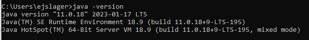
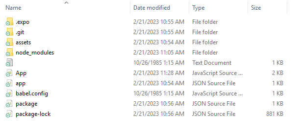
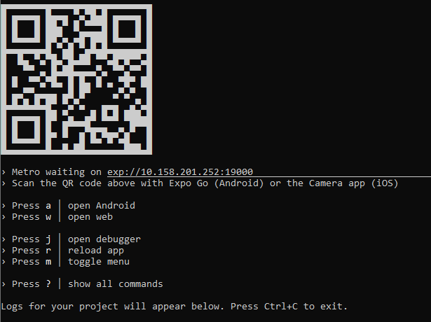
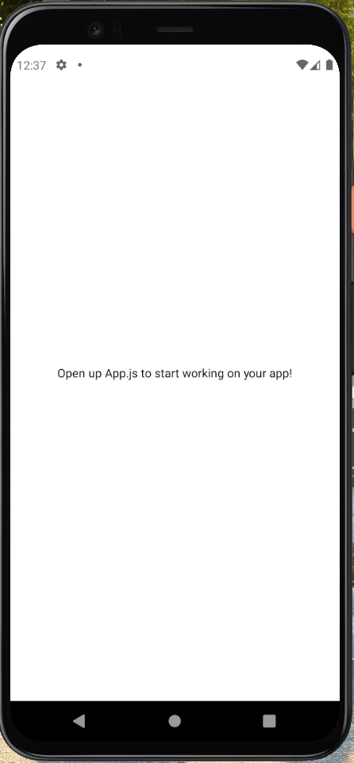
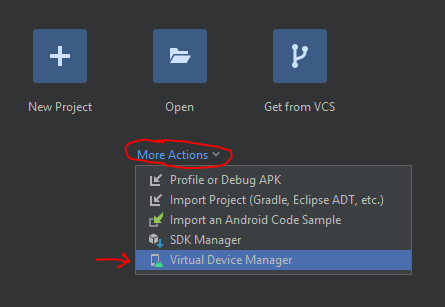
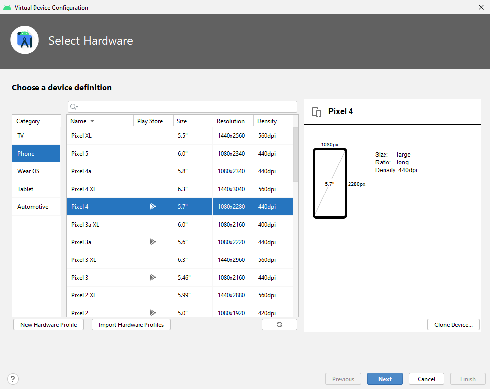

# Lab 8: Setting up your workspace to build a hybrid mobile app

## TGIS 504, Winter 2023, Dr. Emma Slager

### Introduction

So far in the program we have been building interactive maps that we have deployed on the web. Though we have incorporated mobile design principles into our work, we have not yet built tools that can be deployed directly as apps on mobile devices, only those that can be viewed on mobile web browsers. Though mobile-friendly web development has many strengths and applications, there remain some functions that can only be achieved when we develop for mobile platforms directly, for instance, offline functionality. Therefore, in this lab, we use React Native to wrap an HTML/JavaScript application into a native container so that it can be launched as an app. We will develop for the Android platform (testing via an Android device emulator on our desktop computers), because Android's security protocols make that platform more accessible than iOS. 

As a rule, the barriers to entry for mobile app development are higher than they are for web development. To begin developing for web, all we needed was a text editor like VS Code and a web browser to test our work. To begin developing for Android mobile, we need a software development kit (SDK), Java Development Kit (JDK), and some additional tools, plus a device emulator for testing. Thus, our work with React Native is divided into two labs. In Lab 8 you will download and configure a number of new softwares to enable you to build an app with React Native, and in Lab 9, you will carry out the build to package the data collection tool you built in Labs 6-7 as an Android app, test your product, and package it to share with the instructor. 

The instructions in this lab are based off of [React Native](https://reactnative.dev/docs/environment-setup) and [React Native WebView](https://github.com/react-native-webview/react-native-webview#readme) documentation. The exact steps of this lab will depend on your computer's operating system. I have attempted to include instructions for both Windows and OS X below, and although my screenshots will be taken on Windows, I am familiar with both operating systems. It is likely that you will run into some unexpected problems on this lab, as you are configuring settings that will be unique to your device. That likelihood is why I have split this lab into two parts. I encourage you to actively reach out to me for help, to collaborate with peers who are working your same OS, and to use online reference documentation and user message boards to help troubleshoot.

*Technology stack for this lab*

* Node.js (a JavaScript runtime that we'll use to install software)
* Expo command-line interface (CLI)
* Expo Go app (optional)
* React Native and React Native WebView
* Java Developer Kit (JDK) 11
* Android Studio (software development kit, or SDK)

### 1. Installing NodeJS and JDK11

#### 1.1. Install NodeJS

We will install Expo and React Native using NodeJS, a node package manager that which you (may) have used previously in (the optional) lab 3 when working with OpenLayers. 

Hopefully, you still have NodeJS installed from earlier in the quarter, but if didn't attempt Lab 3 or if you've uninstalled it or are working on a new machine, start by downloading the version of NodeJS appropriate for your operating system (Windows, OS X, or Linux) here: https://nodejs.org/en/. Download the installer for 64-bit version of 18.14.2 (this should be the default at the link above), and install it to your computer. 

Once you've installed NodeJS, you will be able to invoke `node`,  `npm`, and `npx` commands on your computer's command line interface. This is how we will install Expo and the React Native libraries we need. As a reminder of how NodeJS works, it is both an interface in the command line (i.e. it gives us access to a library of command prompts that we reference with the 'npx' keyword) and an online registry of software packages. When we install a software through npx, we are directing the computer to both download the program files and install them. 

To test that you installed NodeJS successfully, open your command prompt and enter the following: 

```bash
npx -v
```

If successful, you will see the version number of npx installed on your machine. If unsuccessful, you will get a message that the command npx is not recognized. In that case, go back and try again to install Node. 

#### 1.2. Install JDK 11

It's possible that you already have a version of Java JDK installed on your computer. To check, enter the following in your command prompt: 

```bash
java -version
```

We need Java JDK **11**, so if that command returns a response that you have a version other than version 11 or that the command java is not recognized (no Java installed), please visit [the Oracle site to download the version of Java JDK 11](https://www.oracle.com/java/technologies/downloads/#java11) appropriate for your operating system. After you download the file, run the installer to install the software, following its prompts. To check that your installation was successful, run the ```java -version``` command once more and you should get a response that looks like this: 




### 2. Create a directory to hold your project and install the React Native libraries

Use your file manager to create a folder in your usual workspace to store your lab 8 files (or, if you remember how to do so from lab 3, you can do this in the command line with the `mkdir` prompt). Use the command line to navigate to the folder on your computer where you are storing your lab 8 files. Use the `cd` prompt (Change Directory), followed by the path name to your folder. For instance, for me on Windows, this looks like the following: 

```bash
cd  C:\Users\ejslager\Documents\TGIS504\2023Winter\labs\lab8
```

Next, we will use Node to create a folder for all of your app's files. Enter the following command: 

```bash
npx create-expo-app CollectorApp
```

Note that the name 'CollectorApp' is one you are welcome to change. I've given it that name by default since we are creating an app for data collection. For instance, I might name my app EmmasApp instead. 

If asked, confirm that you want to install the `create-expo-app@1.3.2` package. You've just created a new folder and downloaded to that folder all of the files needed for a basic React Native App. To check that this was successful, navigate in your file manage (Windows file explorer or OS X Finder) to your lab folder. You should see that it contains a new folder called 'CollectorApp' (or whatever you named your folder, which contains a number of items: 



All subsequent commands need to run within the project's directory (in this case, the CollectorApp folder). Change your directory with the following command prompt: 

```bash
cd CollectorApp
```

### 3. Testing our basic app: the easy way

Since we're developing a mobile app, we can't test our work in a web browser the way we would a website. Instead, we need a mobile device emulator. There are a number of ways to set up a mobile device emulator, and in this lab you are going to learn two. The first is quite simple: we'll use an app called Expo Go. 

On your mobile device, navigate to either the Apple App Store or the Google Play Store and search for an app called Expo Go. Its logo looks like this: 


Download and install the app. 

Next, we'll start a development server so we can test changes we make to the app as we work. Enter the following: 

```bash
npx expo start
```

This will return a message that looks something like this: 



Follow the instructions for your mobile device's operating system (Android or iOS) to scan the QR code and open the link with the ExpoGo app. ***Note that you should scan the QR code generated in your own CLI, not the one in the screenshot above.***

For this to work, both your phone and the computer you are working on must be connected to the same WiFi network. If all goes as expected, you should see the following: 



The app is displaying a default message that directs you to edit a file called App.js to make changes to your app. We'll get to that in Step 6 below. But first, you need to learn another way to set up a device emulator. 

### 4. Installing the Android SDK and the Android device emulator

To build and run apps, you need to install SDKs for the platform you wish to target. For Android, this means we'll need the Android Studio SDK and its dependencies. While we're at it, we'll use Android Studio's built-in emulator to test our app another way. 

#### 4.1. Install Android Studio and Android Virtual Device

Visit [this page](https://developer.android.com/studio) to download and install Android Studio in the version appropriate for your operating system. Run the installer to install the software, following its prompts. When given the option to choose components, install both Android Studio **and** the Android Virtual Device:


Once the install is complete, you must also install an Android Virtual Device (AVD), which is a mobile device emulator that you can use to test your work. In Android Studio, click 'More Actions' > 'Virtual Device Manager', or Configure > AVD Manager (the interface varies slightly between versions and OSs). This will open an interface window where you can create virtual devices to emulate specific real-world devices--i.e. you need to choose what hardware and software your emulator will be modelled on.



If you installed the AVD along with Android Studio, you should have one device already in your manager. However, we will create another, ensuring it meets the specifications required by React Native. 

Click 'Create device'. Next, you must select the hardware model you want to emulate. In the Category menu, be sure Phone is selected, then pick a device. The Pixel 4 is a good choice--but make sure that whatever you choose has the Play Store icon listed: 



Click 'Next'. On the next screen, you need to choose the system image (essentially a software version). It is important that you **select S**, with Android API Level 30. You may need to click the download button next to S and download the system image before you can select it. On this screen, you may see a recommendation to install Haxm:


Haxm is a hardware accelerator that will improve the performance of your AVD. Take a moment to install it (with the recommended settings) if it is not already installed. Once you have Haxm installed and the S system image selected, press 'Next'. 

On the next screen, you may give the device a name if you wish, or you can accept the default. Click 'Finish.' The new device should now appear in your list of Virtual Devices. Close the AVD Manager. 

Check that the AVD was installed correctly by opening up the SDK Manager (More Actions > SDK Manager or Configure > SDK Manager). You should see that Android 12.0 (S) is installed. Other versions may also be installed, and that is fine, but if Android 12.0 (API level 31) is _not_ installed, click the checkbox next to it and hit 'Apply'. Click 'OK' to confirm the change and 'Finish' after the installation completes. Close the SDK Manager and close Android Studio. 

The Android Studio installation should have also installed Gradle, another library that we won't use directly but which is required for Android Studio to run effectively. 

Once you've completed these steps, it's a good idea to restart your computer. 

#### 4.2. Setting environment variables

React Native's CLI tools require some environment variables to be set in order to function correctly. Environment variables are dynamic-named values that can affect the way running processes will behave on a computer. You may have experience with setting environments within ArcMap; here, we will set environment variables in the operating system's settings. The methods for doing this vary significantly between OS X/Linux machines and Windows machines, so I will explain the steps separately for each OS. The variables that we need to set and/or edit include: `ANDROID_HOME` and `PATH`. 

#### For Windows 

These exact steps may vary depending on the version of Windows you are running. Please reach out for help if anything in them does not match what you see on your computer or if you have any troubles following these steps. 

1. Click on the **Start** menu in the lower-left corner of the desktop

2. In the search bar, search for **Environment Variables** and select **Edit the system Environment Variables** from the options that appear

3. In the window that appears, click the **Environment Variables** button

4. In the **System Variables** (bottom half of the window), click 'New'

5. In the 'Variable name:' textbox, type ANDROID_HOME

6. Click 'Browse Directory'. Here you need to set the value of the ANDROID_HOME variable to the location of your Android SDK installation. This *should be* located in 'C:\Users\\[Your User Name]\AppData\Local\Android\Sdk': 

   ![Variables screenshot](data:image/png;base64,iVBORw0KGgoAAAANSUhEUgAAAo0AAAClCAMAAAAOEzcNAAABwlBMVEVfosv///8AAADMzMz//7ZmAABmtv9mADqQ2///25A6ADq2ZgA6kNv/tmYAZrYFBwg6AGa2//9mAGY6AAA6kJCQ27b//9uQOgAAAGZmZjq2/7aQtpDbkDoAADoAOpDb//86OpDb/9uQOjoAOmZmOjrw8PB6enqrYAA2h87wq2AAYKvwzoc2ADaHzvDw8KtgADZgq/A6OmY6OgA6Ojo2AGCr8PBgAGAAZmbw8M6HNgBgYDYAAGCr8KuHq4c2AACHh2DOhzYANofO8PBgAADb/7Y2NofO8M6HNjYAADZmtrYANmBgNjaQOmYAeNczmf/MZgCg7v//7v9amf/B//9/mf+gq/9/3v//3v/hzv8zq//h//8zvP/BvP+gvP/h7v/B7v/h3v9azv/B3v+gzv9gNoc2NmBgNmClZgAAYGCtra3h4eHh4aBaAABaoOEzf8HhwX8zADN/weFaADPhoFrh4cF/MwAAWqAAM3/B4eEzAFqg4eEAADOgWgAzAAB/oOHBfzNaWjMAAFozWqBaoKAzMwB/MzN/f1ozMzMzM3+gWjN/oH/B4cFaAFpaM39/waB/M1qgwX9aWlozM1paMzMAM1q/v7+vTvonAAAKLUlEQVR4Aeyd17arNhBAo3EBAnZyesO39957r+n5/7/JDBouxrfiNLO89wNiNOPztJdG4jzouxUCIACsBtgI2AiAjYCNANgI/bYRABsBsBGwEUAGcRzIJ20cjkRkXL0lafZ9qi8e+GORvNDHZBpq/Dde7QPAJxn8MPDh0zYmLQHt+SUbXcR8HFpgYwfQ0R7/jI3ZjxthuLmBjcuCjibjF23MtmQ7SYfJzkhkOmfj7p7I2LL7G8PkYF8l3N0b2/qYW51NHWqlB0dbUtiPYn34JICOLuOn941m2mgcylmqJi2sjZNazUkxHBXBKIvYqK14FO3z4Nhx3UTqW6wP3QBsdJmyE8ft7WMbs62iWjhFpp7R2pOn1DaRyl4ragL1VIdYH7oCdOpP27irwlVbxFDKWEevjKmjE8d1SkvcxibQNh7jALDsKabdqY382PGQT4NSeo/2jPlZhEndlW3ag1Fh/noDB1jiC89IxOwS2Y4q5rHH2vFFhZzYrtJatXdqQ82z9OkztY11cCAy9lNMl04NfP0G4D+DAGtgI2AjADYCNgJgI2AjADYCNgJgI2DjWYDVABsBGwGwEbARABsBGwGwEbARABsBGwGwEbARABsBGwGwEQAbARsBsBGwEQAbARsB/jkbAbDxHKwpK2ljgLUEG/8+gI2AjdgI2AjYeP6CPi5e+hBfvnI1vly7ftWHf9PGeGfXcOQXbPp9Ss097hOPNzc8tXCDsVf4n1DKWeo/hr7Z6CKev9Gu+e9szG6eSU2rW+Noo/plXtk42d8Ik5ld3VWYjZ5asLGpSG5XUyO/grOPYOPlO3fPXrt39/+ysSzKwrTSyzRrG/3CQgvtPuwYq42eamxsVyQHha2l95P+2oiNDx7esPXxvMglNe/R4ydqnwdPn8mFysbLz+Tx3crM56JTc/kbL2wiFlx8+aqrjXbdaxY9zIvaRr/M1S7XjPJpkdtoqbaNTUWys7mhLzt9tREbjRcXYqNW7a69jvZ58PKVbiLtTacuXrDZ15fOXjQv6/xFuWATsWAZG1VFNck9nLdxJDKt0iHGizaOxJilTYUKPdYfvImbT+3yPQQbL799915lEvnJtDPPmkA91UFXPhHbXrbzHswXdLbR2nTp28RpbaP66atea2301GfXRjMzH/sf6SfY+OD907evdPf44H0tWBNoG49xLP0o30wstW/0JW5/I162/nNr32imdto3ptVV7v21ERuNF9ZurSvXgnmgbVs18wZe0co3NnpB905tW0Nvs2ba1szP1GPzrD5Xa+xn6phqbGxX2LvY2GcbsVHN0kVQfvm1FqwOHonc8FNMq1O3ipuCJWzMC3uW1qObT4Wz1G0r443tMg5mo6cWbfxQYcvrbxtzHy2hA/wvpucANg5HwokZG1kb1xpsBGzERsBGwEZsBGxcT2AlbQTARsBGAGwEbATARsBGgH/PRgBsBGwEwMbf1xRYSRvDWgLYCN8ANv6xjvwZ+gM2YiM2YiM2YuNf7JzNrtsgEIXF81Tqri/QVVcWdhyDAze37v/7P0HnZBgfW02EarE0qgLM+RhS+YiJ7wLvXD9Ifxk7fF7140kjUG0Ko03hiSYbx//MD+FVzv2a+YYZ+SS7jYaBPN3Y/m5bxBu4cb5leYBveMa54kYClUa4m+/ve95SXAJn9fwqvMgJ6TU/30b8/+jG042t7rZt70af1zPla8WNBCqNcLfEJT51I0zCWT0/hBc5Ib3mUz8wouTpxiZ327Z3o5kCz8xf6UbU7yyWQZG7fHMjpgV4u6HMIjg5FzSQF4cgeHE3Yfmc70NZxA6Szx3Wo2wHHfELWCZNpSqEfc7vtmcUCd9HFwEsQU0oEDH5F043NrnbFihuIoOMOKRVlvgBN96H1Y0p0o0pdDpJEY9Tpwr0Q3IjgkpoQBAEYeDrBpb0sAQYEawzN/K40hG/QMnUeUTI7XMG23NxokZbBFCDynceFjXs6vN5Nra52xauJavxVT7mRiuYaO/D6sb5Vo46FxDClIB5KImMkQUfyaa8gVFSlwANwraDobheR/wClgkd9/k356Uck1BtEYPKI1tesXs8K3Wju21R0T/++Gyy4pSP/27ka4S333SLMzPgsWKqAN0I2T9x4xZ2aCN07MQOi7leR8y/dyO5fc66GzFDWwLdGE43NrrbFueonKSrTPzwW0xyj3dqqdT6GjHJQP+CsqBGmxsxVYBuTFZ3GcywBGFkVf9FCKVTOnN9GTF/Z5lQqcntc3JPLcG2iEHlpfOR2BRPN7a42xbtw89fn8g+fnJ+KfKhSq3luB/KM8aTw1T/SAdNK7VOAdCNQPv3nRvBb+Ep6smEdwy43joHzNZPLuhI80OMJdMDzdxnm9P2TM5eT3QRg0wYug3m+9+nG5vcbSuYdGSlZP8x+aAbty1FjtnqQBXmm8pf9u3YBmAYBIDghBnETvavMwAFTRDEuqtdIPEdclQ3QHzvFuMyGGvsokY1qjGnxhxqVCNqRI1qRI3t8GcQ8hpBjagR1AhqRI2gRtQIakSNoEbUCGpEjaBG1Li6TRrlX64SxetIaty91qxR1Fi7jnNrVOP+nBrVGKlRjdOpUY1qVKMa1Xg/L3vmoSM5CINhicdlAtks9RLmtvdeHviMibcXVuftSJP2U2Lxf+M4ihBCVUyLHbWU/crwMTS+MTKIa7E6NBpNsSmvhXWeiUbrhAjxeQdWByYaYaL+z1jhOXRcdL4iGAYa3xoZnTQazZQp1LgWSTPlxn6pYPf3Y2iErdJzoONDaayOrNFISUxJtAnWYs2zPKlpUik/hkbj4bC+MfbL/GhMCsV+07p8CeLGWDpiXHCkzqDnPludEF6WwdA0bUPsJkQOGqsjwz38SPydNFK6sDuwFrshMtF4k4NSNhpmxlrgjgl8NHYCpoODhk3lqhAIMHtarmnjiQn9gMZOz7p11FQGY1MelxRL3VgRGRWYhUYSfy2N+1EWmzpAhYvG/Ruu0X2wYWO8td5oztyIFFGRlhTc++Bw/2hn6JdaYsoT/obGHbK86DhE3hmMYB6Pi5PIUzfWRka58UZsufFwZeDOjUaICQ2BLYtkAiuNJeOR53bn9OTo7Dz/H9aEQvFu3Ug0ov4kjXJNr2meurE+MqKRRNnqRkhgvHUjTGt3HtCIe/bcSA9bmH0tPw0vkKc1vehmsKjHTGPRb9I1DS7MXl5hwOX3PzRWR0Y0FvHm3r/wnRoQpEpqLUQWGqUR+E5tQpwNgQ2tnzFgrRsnnB7TLpxmBHAzWLeBKPxtR6Kx6KgqmcpbDM0jk5cMNNZGdpfGIv5iGvPaCDUvSgqRg8ZidojWiesronG2ntb7C3+LSap9i2nfYr4Ijf1+bDQ2Gr8EjdZNQ/tO/a+dO7YBAISBGMj+/e/LEki4uJvBShqCGr2aUKMa1ahGNapRjWp8x5XWby5YXbCCvyZAjagR1EjfpkbUCDY1UZvZiBpJs6kxGM1G1Ag2NXkHOi61IHl9uT0p7gAAAABJRU5ErkJggg==)

   Click OK. The path name should now populate the 'Variable value:' field. 

7. Next, in the list of existing system variables, select 'Path' and click 'Edit'. Click 'New' to add a new path value. 

8. Type ```ANDROID_HOME\platform-tools``` 

   * Alternatively, you can use the 'Browse...' button to navigate to this location. If you go this route, remember that the full path of ANDROID_HOME is likely C:\Users\\[Your User Name]\AppData\Local\Android\Sdk

9. Click 'OK' to close the Path window. Click 'OK' again to close the Environment Variables window, and click 'OK' once more to close the System Properties window. 

#### For MacOS/Linux

For Mac and Linux machines, you can set environment variables using the command line console. 

Open your command line terminal and run the following command: 

```
touch ~/.bash_profile; open ~/.bash_profile
```

This should open a document named `.bash_profile` in your default text editor. In that document, add the following: 

```bash
export ANDROID_HOME=$HOME/Library/Android/sdk
export PATH=$PATH:$ANDROID_HOME/emulator
export PATH=$PATH:$ANDROID_HOME/platform-tools

```

Save and close your text editor. 

Open a new terminal window and run the following to check that your edits saved correctly: 

```bash
source ~/.bash_profile
```

### 5. Test your installation

The first thing we will test is the Android Virtual Device. In Android Studio, open the Virtual Device Manger (More Actions > Virtual Device Manager). Under 'Actions' for the virtual device you set up in 4.1, click the 'play' icon (triangle) to start the virtual device. The virtual device will open, and it will look like a mobile phone interface, with a menu of controls to the right of the phone screen. 

The device is running Android and will behave like an Android phone. If it does not power on automatically, click the power button at the top of the controls menu. On the device's home screen, click the Google Play Store icon to open the store. You will need to log in to the Google Play store with a Google account. Your UW account should work, or you can use a personal Google account. 

In the Play Store, search for the Expo Go app, and install it to the virtual device. This installation works just like it would on any other Android phone. 

Next, open a new instance of the command prompt interface (if yours is open from prior steps, close it and reopen it).

Navigate to your `CollectorApp` folder using the `cd` (change directory) command, adding the path name to the location of your folder. Run the following command once again to start the demonstration server: 

```bash
npx expo start
```

This time, instead of using the QR code to test your app, type and enter `a` in your command prompt. This command will open the app in the Android device emulator (`a` is for Android). At this time, the app should look the same as it did when you tested it on your own mobile device: a white screen displaying some boring default text. Let's make that a little more fun, shall we? 

### 6. Making simple changes to the app

The default text tells us that we need to edit a file called App.js to make changes to our app. Open VS Code or another text editor and open the CollectorApp folder as a project folder. 

You should see the file called 'App.js'--click it to open it. The code in this file is relatively brief. It looks as follows: 

```javascript
import { StatusBar } from 'expo-status-bar';
import { StyleSheet, Text, View } from 'react-native';

export default function App() {
  return (
    <View style={styles.container}>
      <Text>Open up App.js to start working on your app!</Text>
      <StatusBar style="auto" />
    </View>
  );
}

const styles = StyleSheet.create({
  container: {
    flex: 1,
    backgroundColor: '#fff',
    alignItems: 'center',
    justifyContent: 'center',
  },
});
```

We'll get into what each part of this means next week, but for now, focus on line 7, which contains the `<text>` tag. Try changing this text from "Open up app.js to start working on your app!" to something else. Use it to tell your audience what your favorite map project is, or list your top 5 favorite albums, or describe the last thing you ate. 

Save your changes and view your app on the virtual device. If nothing has changed, return to the command prompt window and type the `r` command (`r` is for reload). You should see your new text when the app reloads. 

Next let's make some changes to the styles. Change the background color to a color of your choice. Next, add a new declaration to the stylesheet: 

```
padding: 20,
```

Save your changes and see how that changes things. 

Optionally, if you want to make more style changes, use the [React Native style documentation](https://reactnative.dev/docs/style) and experiment on your own. Otherwise, this is enough change for now--we'll get into more next week. 

### 7. Submission

Your submission this week is simple: just a screenshot of your Android Virtual Device showing your app, with the changes specified in Step 6 above. Note that this must be a screenshot of your Android emulator, not the Expo Go app on your own mobile device. 

If there is anything in these instructions that you feel unsure of--for instance, if you aren't sure you set your environment variables correctly--it is your responsibility to make an appointment with me. While some errors in this week's work won't terminally impact your ability to produce this lab's deliverable, they will likely impact your app build in Lab 9, so please let's get them sorted sooner than later. 