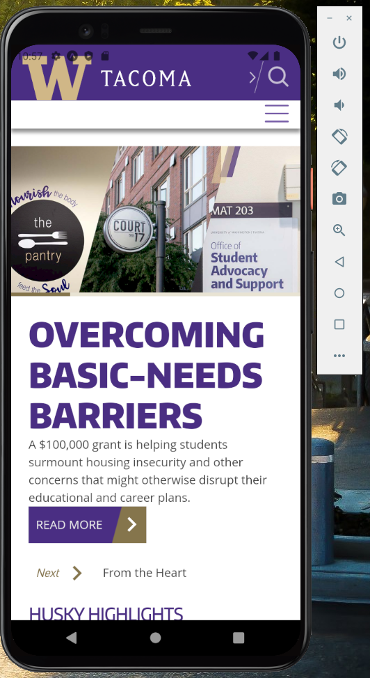

# Lab 9: Building a hybrid app for Android with React Native

## TGIS 504, Winter 2023, Dr. Emma Slager

### Introduction

Now that you've set up your development environment, the next step is to build and customize your app, then package it for distribution. 

In this lab, you will use the Command Line Interface to build your app for the Android platform, customize it with an icon and splashscreen, test and debug your app, and submit an APK  file of your app on Canvas. You will also write a brief report explaining your process and product, including screenshots and highlights from your app that you can include in your Portfolio to showcase your work to future clients or employers. 

The instructions in this lab are based off of [React Native](https://reactnative.dev/docs/environment-setup) and [React Native WebView](https://github.com/react-native-webview/react-native-webview#readme) documentation. The exact steps of this lab will depend on your computer's operating system. I have attempted to include instructions for both Windows and OS X below, and although my screenshots will be taken on Windows, I am familiar with both operating systems. If you run into issues or challenges, I encourage you to actively reach out to me for help, to collaborate with peers who are working your same OS, and to use online reference documentation and user message boards to help troubleshoot.

*Technology stack for this lab*

* Expo command-line interface (CLI)
* VS Code (or other text editor)
* Expo Go app (optional)
* Android Virtual Device (mobile device emulator)
* [EAS Build](https://docs.expo.dev/build/introduction/) (service for building APKs and other app files)

### *Step 0. Fixing a past mistake*

In testing, it became apparent that the connection errors that many of you were getting with the SQL API were fatal to the success of this lab. Thus, I finally resolved that issue, but the fix requires that you make some relatively simple changes to your **Lab 7 (SQL for back end mobile data collection)** work before you proceed. This step walks you through those. 

Open up your repository for Lab 7 on [github.com](https://github.com/). Edit the JavaScript file to change the value of the `url` variable so that it no longer points to the IP Address of the sql server. Change it so it reads as follows: 

```javascript
var url = "https://gisdb.xyz/sql?q=";
```

Commit your changes. 

Visit the Pages site where the repository files are live. Wait a moment if necessary for the Pages servers to update, and test your map to ensure that you can see existing points on the map and add new points without an errors being logged to the console. 

Once you've confirmed that the SQL API is working to send and receive data between your map and the database, you are all set to proceed with lab 9! 

### 1. Installing React Native WebView

We begin where we left off on Lab 8. Open your command line interface, use `cd` to navigate to your React project folder (`CollectorApp`). 

To use React Native as an app wrapper, we're going to use a package called [React Native WebView](https://github.com/react-native-webview/react-native-webview). The steps for this are to: 1. install the files needed to use the package, 2. import the WebView component into the App.js file in our React Native project folder, and 3. add some additional code to the App.js file that uses the WebView functionality. We start here with step 1: installing the necessary files. 

In the command line interface, while inside your `CollectorApp` folder, run the following command: 

```bash
npm install --save react-native-webview
```

This will add some additional files to the `node_modules` folder inside your `CollectorApp` folder that will allow us to access the functionality built into the React Native WebView package. 

### 2. Make changes to App.js to use WebView

Next, open up your App.js file in VS Code or the text editor of your choice. To the list of import statements at the top of the file, add the following: 

```javascript
import { WebView } from 'react-native-webview';
```

When we downloaded the WebView package in step 1, we made it available to import into the project. When we import that package into the project in this step, we make the functions in that package available to use in our code. 

The next step, then, is to write some code that uses the functions in the WebView package. In the body of the App.js file, **replace** the section of code that inside the `return ()` statement so that it reads as follows: 

```javascript
return (
	<View style={{flex: 1}}>
    	<WebView source={{ uri:'https://www.tacoma.uw.edu/'}}/>
		<StatusBar style="auto"/>
	</View>
)
```

Next, open the emulator to view your changes. In the CLI run the following command: 

```bash
npx expo start
```

Use either the QR code to view the app on your own smartphone device, or use the `a` command to open the app on the Android emulator on your computer. If all has gone well, you should see a screen that looks like the following: 



Here we are displaying data from the URI (Universal Resource Identifier, of which a URL like a web address is a subset) specified in our code, in our case https://www.tacoma.uw.edu/. Basically, we have taken files from the specified website and packaged them up as an app. This is the basic idea of web wrappers. 

However, you want your app to display your data collection app, not the UW Tacoma homepage. To achieve this, change the value of the URI in the App.js page to the URL of your data collection map, where it exists on GitHub pages. 

Save and test your changes (use the `r` code in the CLI to refresh the emulator app if it hasn't reloaded automatically), and troubleshoot if anything looks wrong.

### 3. Improving the interface

#### 3.1. Status bar overlap

When testing your app, you may notice that the status bar at the top of the page overlaps with the map. In fact, this like makes some of the controls of the map--such as the zoom in button--difficulty or impossible to use. Let's fix that. 

Notice that when we changed the value of the `return ()` statement in step 2, we removed the reference to the const `styles` that is declared at the bottom of the code. Instead, we are declaring our styles in-line in the `<View>` component. We'll next change the `<View>` style declaration to again reference the const `styles`, then make some adjustments to the styling to fix the issue with the status bar overlapping the map. 

In App.js, change the line of code that reads `<View style={{flex:1}}>` to the following: 

```javascript
<View style={styles}>
```

Next, set the const `styles` as follows: 

```javascript
const styles = StyleSheet.create({
	flex: 1, 
    paddingTop: 30,
});
```

By adding the padding to the top of the app view, we can resolve the status bar issue. (Note that the `flex:1` declaration, carried over from one of the code blocks in step 2, is necessary for the overall layout. You can find the documentation on this property [here](https://reactnative.dev/docs/flexbox).)

#### 3.2. Icon and splash page

In your computer's file manager (Windows File Explorer or MacOS Finder) examine the files in your main project folder (CollectorApp or whatever you named your project). You should see a folder called `assets`. Open this folder to examine its contents. You should see a number of image files, favicon.png, icon.png, adaptive-icon.png, and splash.png. These are the image files used to create your app's icons and splash page. 

In VS Code, open the file in your main project folder called `app.json` (this is different from `App.js`). Here you'll see a JSON file that defines how the app is bundled for different platforms and specifies which of the images in the assets folder is used to make the app for different platforms. 

Notice that when you build the app for testing with the Expo Go app, icon.png is used and the splash page comes from splash.png. However, when you build for Android, the splash page is constructed using adaptive-icon.png on a background color that is here specified as #FFFFFF (or white). 

Instead of using these defaults, create your own images for your app icon and splashpage. Use these steps: 

* Save the defaults as back-ups and reference files by changing the name of each file currently in the assets folder to `[original_name]-old.png`. 
* Using one of the tools demo'd in class or tools of your own, create an icon image that you want to use for your app. Any images you use should be licensed for reuse, if you don't create them from scratch yourself. Save versions of your app icon as icon.png, adaptive-icon.png, and favicon.png. Note that the favicon version should be 48x48 pixels, but the icon and adaptive-icon can and ideally should be larger, just make sure that they are square. Also make a splash page. An easy way to do this is to edit the splash.png file originally in the assets folder, replacing the default logo at its center with your own logo. 
* When you're done, make sure that all of your files are saved in the assets folder. 
* The easiest way to ensure the correct images get used when your app is built is to ensure that the names of each of the images matches the original file names of the original image files saved in the assets folder. However, if you prefer to use your own file names, make sure that you edit the `app.json` file accordingly to update the file names/paths where necessary. 

When you're done, reload the app in your Expo Go app and/or the Android emulator and notice the change to the splash page (the icon won't appear until you build a version of the app outside of Expo, which you will do in the next step). Make any adjustments to the splash page if you wish. 

#### 3.3 Making the splash page work in the final build 

While we can see the splash page fine in testing thanks to Expo Go, we will run into an issue with the splash screen displaying improperly in the final build unless we make some additional changes to the code. 

First, we want to install a component that will help us with this task, [Expo SplashScreen](https://docs.expo.dev/versions/latest/sdk/splash-screen/). To do so, run the following command in the CLI (after stopping the emulator with the ctrl + c command):

```bash
npx expo install expo-splash-screen
```

Next, add the following imports to the list at the top of the App.js file: 

```javascript
import React, { useCallback, useEffect, useState } from 'react';
import * as SplashScreen from 'expo-splash-screen';
```

After the import statements and before the `export default` function, add the following line of code: 

```javascript
SplashScreen.preventAutoHideAsync();
```

Next, inside the curly brackets of the `export default function App() { ` and before the `return()` statement, add the following large section of code: 

```javascript
 const [appIsReady, setAppIsReady] = useState(false);

  useEffect(() => {
    async function prepare() {
      try {
        // Pre-load fonts, make any API calls you need to do here.
        // We do not use any of these in our app, but we feasibly could. 
      } catch (e) {
        console.warn(e);
      } finally {
        // Tell the application to render
        setAppIsReady(true);
      }
    }

    prepare();
  }, []);

  const onLayoutRootView = useCallback(async () => {
    if (appIsReady) {
      // This tells the splash screen to hide immediately! If we call this after
      // `setAppIsReady`, then we may see a blank screen while the app is
      // loading its initial state and rendering its first pixels. So instead,
      // we hide the splash screen once we know the root view has already
      // performed layout.
      await SplashScreen.hideAsync();
    }
  }, [appIsReady]);

  if (!appIsReady) {
    return null;
  }
```

Examine this code and its comments. The basic effect of this code is to check to see if the app content has loaded, and once it has, to hide splash screen. In the first section of the code, the `prepare()` function gives us a space to asynchronously pre-load resource-intensive parts of the app, such as fonts and APIs. Because we're using WebView, we don't have any of those in this in this app, but I've left that code section to show you how you could use it. 

Finally, make the following change to the `<Webview>` element so that the `onLayoutRootView` callback functions properly: 

```javascript
      <WebView source={{ uri: 'yourURIhere'}} 
      onLayout={onLayoutRootView}/> //add this part, then delete this comment
```

Save your changes, then back in the CLI, run the `npx expo start` command to re-start the emulator and make sure things are working as expected. Troubleshoot if needed.

### 4. Build final version app

Instructions to come

### 5. Write up and submission

On Canvas submit the following: 

* A write-up containing 
  * A description of your app, including screenshots, written for a public audience. This should be appropriate for including in your Portfolio as an example of your work that you might show to potential clients or employers. 

* The APK for the emulator version of your app (app-debug.apk file, renamed so that I can distinguish it from your classmates' submissions)
* I will award bonus points on a case-by-case basis for particularly effective implementations. 

